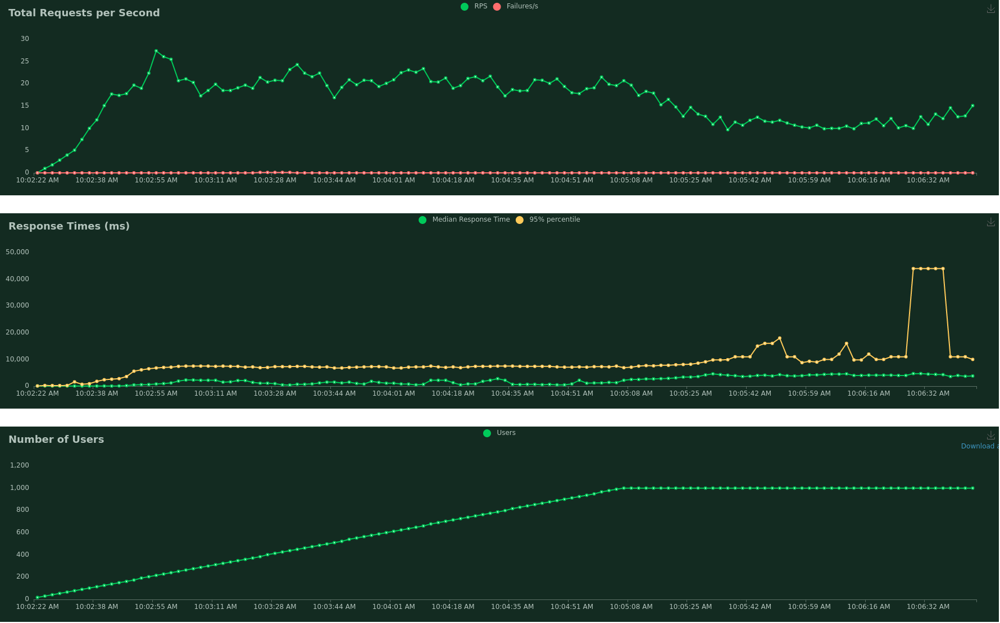

## BARAN Rémi - DERHILLE Erwan - DESSOLY Tanguy - LABADIE Pierre 

### Mail contact professeur
yann.coornaert1@mail-formateur.net

### Lancement du projet
python -m virtualenv venv
source venv/bin/activate //Pour windows: venv/Scripts/activate.bat
pip install -r requirements.txt

uvicorn main:app --reload 

locust --config=.locust.conf

### Pylint
pylint application/ tests/

### Coverage
coverage run -m pytest --profile # remplace la commande python
coverage html # génère le rapport en html

### Test
python -m pytest

# Spécifications

Un fichier readme indiquant le groupe et décrivant ce qui a était réalisé, permettant de fournir des informations si nécessaires.

## Code
- [X] Création d'un endpoint qui permet de faire combattre 2 pokémons en fournissant leur ID.
- [X] Endpoint qui liste 3 pokémons aléatoires ( avec affichage des stats )

## Locust
- [X] Rédaction d'un scénario ( pertinent )
- [X] Un exemple de test de performance à réaliser fourni via un .locust.conf.
 Ici, on créé un utilisateur, on lui attribue un nom, on lui attribue un pokémon et un item, on fait combattre le pokemon créé avec un pokemon existant. Comme cela, on teste la création, l'attribution puis le combat. Cela à l'échelle de sortie du jeu, donc 1000 utilisateurs sur une heure à la hauteur de 6 utilisateurs par secondes.

## Pylint
- [X] Note minimale de 8.5/10

## Unittest
- [X] 7 tests unitaires
- [X] 5 tests unitaires mocks

## Coverage
- [X] 85% -> 95% ! 